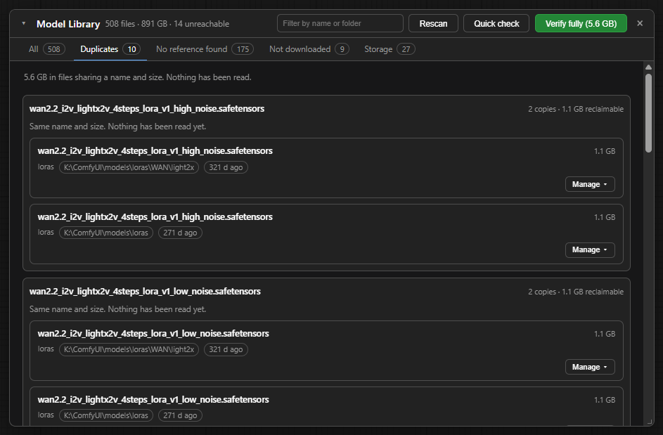

# Model Library

Everything on disk, across every model folder ComfyUI registers — including the ones on
other drives.

Off by default. Switch it on under **Open Manager → Library**; a **Models** button appears in
the workflow tab strip. It also opens from the Open Manager menu and the command palette.

Nothing is read until the panel is opened, and nothing is hashed until you ask for it.

## What it answers

ComfyUI can be pointed at several drives at once through `extra_model_paths.yaml`, and once it
is, nothing tells you what you have. So the library answers four questions.

| Tab | Answers |
|---|---|
| All | What is there — every model file, its folder, which drive, when it last changed |
| Duplicates | What is there twice, and how much of it you would get back |
| No reference found | What no saved workflow appears to ask for |
| Not downloaded | What a workflow asks for that is not on disk — and fetches the ones it can |
| Storage | Where it all is, and how full each drive is |

## Duplicates, and what a duplicate claim is worth

Reading two 20 GB files to prove they match is not free, so the same question is asked at three
depths and the answer always says which was used.

| Depth | Reads | Says |
|---|---|---|
| Names | Nothing | Same name and size. Nothing has been read. |
| Quick check | 2 MB per file | Same name, size, and the first and last megabyte. |
| Verify fully | Every byte | Identical, with the hash. Or: same name, different contents. |

Only the full check reports reclaimable space, because only the full check has earned the
right to. The first two can disprove a match but never prove one — so they never claim one.

**Same name, different contents** is the finding worth having. Which of the two loads depends
on the order ComfyUI searches its folders, so a workflow naming that file may not be getting
the one you mean.

## Not downloaded

Two different questions wear the same name here, and the tab keeps them apart.

**What can be fetched.** Where a workflow recorded *where* a model came from — ComfyUI writes
that on the node as `properties.models` — the tab lists it with the account it came from and
the workflows waiting on it, selectable, with one **Download** button for the batch. That runs
through the same trust prompt, the same free-space check and the same queue as a download
started anywhere else; there is no second path to the network here.

Trust is asked once per account, and declining one account does not cancel the others in the
batch — what was skipped is named, so a mixed batch never goes quiet on you.

**What cannot.** A workflow that only names a file gives a filename, and a filename is not a
source. Those are still listed, because knowing what is missing is the point, but nothing here
can fetch them.

## Per file

The **Manage** menu on any row offers:

- **Hash** — sha256, taken once and remembered against the file's size and modification time,
  so a file replaced in place is hashed again rather than reported as what it used to be.
- **Where it came from** — the download that fetched it, the account it came from, the hash
  that was expected, and the saved workflows naming it. A model you copied in by hand says so
  rather than showing an empty panel.
- **Copy path**, **Copy hash**.
- **Delete file** — one file, confirmed, and only inside a folder ComfyUI registers.

## What it will not do

- **Delete more than one file per request.** There is no route that takes a list. A sweep over
  model files run by a web request is not a thing this offers.
- **Touch anything outside a registered model folder.** A path is resolved and checked against
  the folders ComfyUI itself declares, and `custom_nodes`, `input`, `output` and `temp` are
  excluded from the library entirely.
- **Claim a reference search is exhaustive.** It reads saved workflow JSON. A workflow saved in
  API form, a widget shape it does not recognise, or a path built at run time will not appear —
  so "no reference found" means what it says and not "unused".

The one sweep that exists is for `.part` files left behind by downloads that stopped, shown on
the Storage tab, and it only ever removes part files that no entry in the Download Manager is
waiting on. It is not shown at all when there are none.

## Settings

Under **Open Manager → Library**.

| Setting | Default | What it does |
|---|---|---|
| Model Library panel, and the Models button | **off** | The whole feature, and the Models button. |
| Let the Model Library read the contents of a file | on | Hashing and full duplicate confirmation read a model end to end — on a large library that is hundreds of gigabytes. Turn it off and the library still reports names, sizes, folders, duplicates by name and what nothing references, and never opens a file. A digest already taken is still shown. |
| Show what each pack costs to load, on the Installed list | off | Reads ComfyUI's own import timings back out of its log and puts the seconds beside each installed pack. Nothing is measured or run. |

Shared with every window, under **Open Manager → Windows**:

| Setting | Default | What it does |
|---|---|---|
| Model Library as a window | on | Off, it opens as a modal: centred, in front of everything, closing when you click away or press Escape. Each surface has its own toggle, so the Library can be a window while the Memory panel is not. |
| Default window size | `large` | `compact`, `standard` or `large`. Scales each window's own default, so their relative sizes are kept. A window you have resized keeps the size you gave it. |
| Header height | 44 | 24 to 80. |
| Title text size | 15 | 10 to 28. The title bar and section headings, independent of the header height. |
| Content text size | 13 | 10 to 22. Body text inside windows. |
| Drop shadow | on | The shadow that lifts a window off the graph behind it. |
| Windows can be dragged | on | Presentation only. Off, a window always opens in the middle and cannot be dragged away. A screen too small to move a window around in presents it centred whatever this says, and goes back to floating when there is room again. |

And under **Open Manager → Interface**:

| Setting | Default | What it does |
|---|---|---|
| Where the Downloads, Models and Memory buttons sit | `topbar` | `topbar` puts Downloads, Models and Memory in the workflow tab strip with their names. `control` puts them in the floating control bar as icons. |

## Access keys

The library needs none. Fetching a gated model does: set `HF_TOKEN` before ComfyUI starts, or
paste it into **Open Manager > Access keys**. See [DOWNLOADS.md](DOWNLOADS.md).

## Related

- [DOWNLOADS.md](DOWNLOADS.md) — fetching the models this lists, and where they land.
- [MONITOR.md](MONITOR.md) — what is loaded into memory right now, as against on disk.
