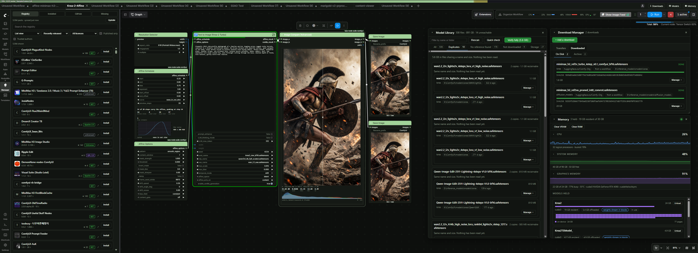

# Open Manager for ComfyUI     [](https://paypal.me/ThompsonJordan?country.x=US&locale.x=en_US)




https://github.com/user-attachments/assets/58e5d65e-ce23-464b-8c9a-2a249818a1d1

## An alternative package manager for ComfyUI.

Browse the Comfy Registry with ease, install from registry or GitHub, and see what
an install would do to your environment before it runs. It warns; it never blocks.

**_Open Manager_** _is not affiliated with ComfyUI-Manager or the Comfy Registry._

---

## Why Open Manager?

ComfyUI-Manager installs packs well. Open Manager is built around telling you what you are
installing before it happens.

| | |
| --- | --- |
| Every version, with its status | Flagged and withheld included, never hidden and never silently swapped for an approved one |
| Before you install | The findings against that version, the dependency changes it would make, the nodes it adds, and whether the ComfyUI and hardware it asks for match yours |
| What's in the box | A GitHub install is read first: compiled binaries, pickle data, bundled wheels and sourceless bytecode are named, with what each means. False positives possible |
| Licences | Read from each pack, sortable, most permissive first |
| Your own list | Repositories you add by URL, with an update path and inspection, kept in `user/` so they outlive an uninstall |
| Trust the author | A pack from outside the registry asks who you are trusting, once per author or every time |
| Any ref | Read and install a pack at another branch or recent commit, README and gallery together |
| Missing nodes | The packs supplying the node types a workflow is missing |
| Node names claimed twice | Silent in ComfyUI, where the last pack loaded wins. Named here, with which one is in use |
| Fast sync | The whole Comfy Registry in seconds, at a concurrency you set |

A risk changes the wording of the confirmation, not whether Install works. The one exception is
a version the registry has banned; a setting lifts that too, because the registry's scanner bans
for reasons it does not publish (`OPEN_MANAGER_ALLOW_BANNED=1` for a headless host).

### Beyond packs

Three pieces sit alongside the pack manager. None of them adds a node to your graph.

| | | Default |
| --- | --- | --- |
| [Download Manager](DOWNLOADS.md) | Fetches the models a workflow needs: resumes, verifies, and picks the drive | on |
| [Model Library](MODELS.md) | What is on disk across every registered folder: duplicates, unreferenced, storage | off |
| [Resource Monitor](MONITOR.md) | A compact CPU/RAM/VRAM strip, and a Memory panel behind it | off |

---

## Installing

Two ways to load, one core. Pick either.

**As a custom node**, beside the official manager. Clone into `custom_nodes` and restart:

```sh
cd ComfyUI/custom_nodes
git clone https://github.com/WASasquatch/open-manager-comfyui.git
```

It coexists with ComfyUI-Manager and adds its own sidebar tab.

**As a pip package**, through `--enable-manager`:

```sh
pip uninstall comfyui-manager
pip install git+https://github.com/WASasquatch/open-manager-comfyui.git

# Launch ComfyUI with --enable-manager flag
python main.py --enable-manager
```

It takes the `comfyui_manager` name and replaces the official manager. A later install of
`comfyui-manager`, or a desktop auto-update, puts the official one back.

In this mode it also writes `user/comfyui.log`, rotating to `comfyui.prev.log` and
`comfyui.prev2.log`, because ComfyUI writes no log of its own unless launched with
`--file-log` and the file usually there is written by the manager being replaced. Set
`OPEN_MANAGER_NO_LOG` to leave it alone.

Nothing is downloaded or built at load time. You decide what to install.

### Access keys (Optional)

| For | Variable | Get one at |
|---|---|---|
| Gated and private models | `HF_TOKEN` | huggingface.co/settings/tokens |
| Starring, higher rate limit | `GITHUB_TOKEN` | github.com/settings/tokens |
| Scanning an install | `VIRUS_TOTAL_KEY` | virustotal.com/gui/my-apikey |

---

## Notes

**Internet required.** Open Manager reads the Comfy Registry live. It contacts these hosts,
and only these:

| Host | When |
|---|---|
| `api.comfy.org` | browsing and installing |
| `cdn.comfy.org` | downloading a registry version to install |
| `codeload.github.com` | downloading a GitHub repository to install |
| `raw.githubusercontent.com` | licences, READMEs, images |
| `api.github.com` | a pack page's stats and gallery, branches and commits, starring, and the licence lookup when it is on |
| wherever a pack points | a gallery entry given as an absolute URL. Turn galleries off to keep to the hosts above |

**Where it appears.** A sidebar tab on the current interface. On ComfyUI's legacy menu
(`Settings -> Comfy -> Use new menu -> Disabled`) it adds an **Open Manager** button there
instead. Where it replaces the manager, the top menu's **Extensions** button opens it too.

**What Extensions opens.** It follows ComfyUI: the panel on the modern interface, and the
classic menu of destinations where ComfyUI was started with `--enable-manager-legacy-ui`.
Override it under *What the Extensions button opens*. Both carry every destination, so this
decides the way in rather than what is reachable, and the sidebar tab is unaffected.

**Trust.** Incoporated a simple trust gate for certain actions with Open Manager.
Make sure you trust the authors.

**Settings.** Under `Settings -> Open Manager`. Set `open_manager.registry.BASE_URL` to route
the registry through a mirror or a private index. Set a GitHub token to raise the anonymous
60 calls an hour to 5,000; without one, pack pages still show their README, gallery and
versions.

**Requirements.** `torch`, `torchaudio`, `torchsde` and `torchvision` are never installed
from a pack's requirements: they carry the build your ComfyUI was set up with. Anything held
back is named in the install output. To substitute a package, map it in
`user/open_manager/pip_overrides.json`:

```json
{ "opencv-python": "opencv-python-headless>=4.9" }
```

**Trust.** A pack from outside the registry asks who you are trusting before installing it,
and again before loading a workflow of theirs. Answer once per author or every time, under
`Settings -> Open Manager`. Trusted authors are written to
`user/open_manager/trusted_authors.json`, and trust never hides a finding.

**Your GitHub list.** Add repositories by URL or as `owner/repo`. Each installs, updates and
uninstalls like a registry pack. The list is written to
`user/open_manager/github_sources.json`, outside the pack, so it survives an uninstall.
**Remove from list** delists and uninstalls in one step.

---

## For pack authors

Declare a `[tool.open_manager]` table in your `pyproject.toml`. Every field is optional and
packs without the table are unaffected. For an installed pack these are read from the copy on
disk, with the repository as the fallback.

```toml
[tool.open_manager]
incompatible = ["numpy>=2.0"]                   # declare known conflicts with other packages
source = "github"                               # prefer installing from the repository
branch = "main"                                 # default branch to install from
docs = "https://example.com/docs"               # documentation URL
funding = "https://ko-fi.com/you"               # funding URL
release_note = "1.4.0 needs config regen."      # shown above the version list, 600 chars
example_workflows = ["workflows/*.json"]        # a path, a glob, or a directory
themes = ["themes/my-theme.json"]               # list themes to offer
gallery = [                                     # shown off on the pack page, up to 24, `png`,
                                                # `jpg`, `jpeg`, `gif`, `webp`, `avif`, and
                                                # `mp4`, `webm`, `mov` for clips
  "docs/*.png",                                 #   a path or glob in your repository
  "https://cdn.example.com/after.webp",         #   or a file hosted anywhere
]
```

Leave `example_workflows` out and `workflows/`, `workflow/`, `examples/`, `example/` and
`example_workflows/` are read instead. An image named for a workflow beside it becomes its
thumbnail. `docs` and `funding` fall back to `[project.urls]`.

---

## Theme format

A theme is a ComfyUI colour palette with an optional `extras` block. ComfyUI reads `colors`
and ignores `extras`; Open Manager reads both. Themes listed in `[tool.open_manager] themes`
appear on the pack page with an Add button. Copy one of the six in
[`open_manager/themes/`](open_manager/themes/), change the id and the colours.

```jsonc
{
  "id": "my_theme",              // unique; the key it is stored under
  "name": "My Theme",            // shown in the theme picker
  "version": 1,                  // raise to publish a change
  "light_theme": true,           // light palettes must set this, or the interface stays dark

  "colors": {
    "node_slot":      { "IMAGE": "#64b5f6", "LATENT": "#ff9cf9" },   // wire colour per socket
    "litegraph_base": { "CLEAR_BACKGROUND_COLOR": "#211927",         // canvas
                        "NODE_DEFAULT_COLOR": "#f2ff59",             // node header
                        "NODE_DEFAULT_BGCOLOR": "#2e2438",           // node body
                        "BACKGROUND_IMAGE": "data:image/svg+xml;base64,..." },
    "comfy_base":     { "fg-color": "#f0efed", "bg-color": "#211927" }  // interface, incl. Open Manager
  },

  "extras": {
    "shape":      { "radius": 10, "titleHeight": 28, "slotHeight": 20 },
    "links":      { "mode": "spline", "border": false },   // spline | linear | straight
    "categories": { "loaders": "#352864", "sampling": "#4d3979" },  // header per node category
    "nodes":      { "KSampler": "#6b4fa8",                          // header per node class
                    "VAEDecode": { "color": "#71639a", "title": "Decode" } },
    "glow":       { "selected": "#f2ff59", "blur": 16 }             // static, on selection
  }
}
```

| | |
| --- | --- |
| Categories | Matched on the full lowercased category path, longest first, so `was suite/image/masking` wins over `was suite/image`. Core nodes also match the segment below `model/` |
| Precedence | A colour the user set on a node wins, then a `nodes` rule, then a `categories` tint |
| Nothing is saved | Header, title and text colour are applied for the draw and undone after, so they never enter a saved workflow |
| Bounded | Unknown keys are dropped and numbers are range-checked; there is no animation, and a theme cannot ask for one |
| Scoped | Theme color palette `extras` apply only while your theme is active, and geometry is restored when the user switches away |

---

## Licence

MIT, see [`LICENSE`](LICENSE).

The GitHub mark shown on links to github.com is `mark-github` from
[Octicons](https://github.com/primer/octicons), MIT licensed, Copyright (c) GitHub Inc. It is
used only for links that go to GitHub.
