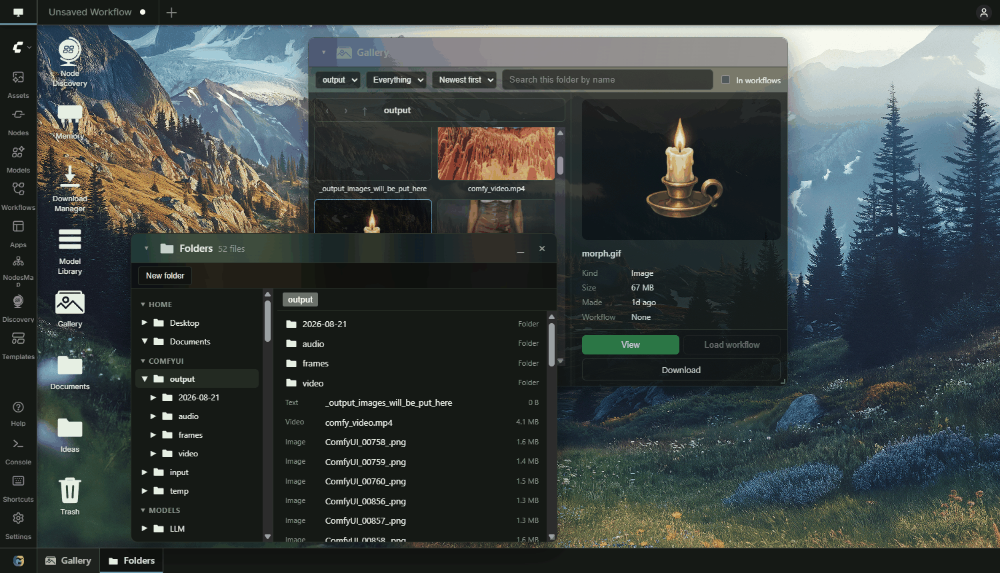

# Desktop Mode

A desktop on a tab of its own, beside your workflows. Windows, a taskbar, a Start menu, files,
notes and programs. Off by default: launch ComfyUI with `OPEN_MANAGER_ENABLE_DESKTOP=1`, then
**Settings → Open Manager → Desktop → Desktop mode**.

Built for a ComfyUI you reach over the network: Vast.ai, RunPod, a LAN box. Files, notes and
outputs without a second tool, a second port or a second login.

---

## The tab

| | |
|---|---|
| Where | At the left of the workflow tab strip |
| What it covers | The graph, which is not replaced: a run still queues while the desktop is up |
| On startup | It opens when there is nothing to restore and no workflow is open |
| Coming back | This browser remembers whether it was showing, and which windows were open |
| Leaving it | Click any workflow tab, or press Escape |
| Straight to it | `#desktop` on the URL |

Turning Desktop mode on turns the taskbar on.

## The desktop

| | |
|---|---|
| Icons | Double-click to open, drag to arrange, right-click for the menu |
| Keyboard | Arrows move, Home and End jump, Enter opens, F2 renames, Delete trashes |
| Right-click | New note, new folder, new workflow shortcut, Trash, arrange icons, settings, leave |
| Wallpaper | An image from your wallpapers directory, drawn cover, contain, centre or tile |
| Taskbar | Open windows along the bottom, with a Start button at the left |

## What is on it

| Icon | Opens | Starts |
|---|---|---|
| Node Discovery | The pack manager | on the desktop |
| Memory | What is loaded | on the desktop |
| Download Manager | The download queue | on the desktop |
| Gallery | The images and videos this install has made | on the desktop |
| Trash | What you deleted, until you empty it | on the desktop |
| Model Library | What is on disk | with **Open Manager → Library → Model Library panel** |
| Documents | Your own notes and folders | with `OPEN_MANAGER_ENABLE_FILES=1` and **Open Manager → Desktop → ComfyUI file browser** |
| Folders | Every directory ComfyUI registers | Start menu, same switch |
| Notepad | A blank note | Start menu |
| Desktop Settings | Wallpaper, icons, windows, taskbar, programs | Start menu |
| Manage Programs | What is installed and what it declares | Start menu |

Whatever you keep in your Desktop folder joins them: notes, folders and workflow shortcuts.
Anything in the Start menu can be pinned to the desktop, and anything on the desktop can be
taken off it again.

## Programs

In the Start menu, and on the desktop where the program asks for it. Desktop Mode is not needed:
the Start menu comes with the taskbar, so programs open over the graph with only **Settings →
Open Manager → Windows → Taskbar along the bottom** on.

| Program | Does | Where |
|---|---|---|
| Gallery | Browse the images and videos this install has made | desktop, Start menu |
| Nodes | Search every registered node type, drag one onto the graph | Start menu, ComfyUI |
| Outputs | What this ComfyUI has made, newest first | Start menu, ComfyUI |
| Timer | How long each node takes, live, run by run, workflow by workflow | Start menu |
| Templates | ComfyUI's workflow templates, in a window | Start menu, ComfyUI |
| ComfyUI Settings | Every ComfyUI setting, in a window you can leave open | Start menu, ComfyUI |
| Scratch | A pad for short notes | Start menu |
| Attack of the Nodes | A game | Start menu, Games |
| Image Viewer | Zoom, fit, rotate, crop, save | opened by what needs it |
| Video Player | Video and audio | opened by what needs it |

Programs are directories under `open_manager/web/programs/`, each with a `manifest.json` and a
`program.mjs`. **Manage Programs** searches them by name, author or keyword, and gives each one
a page: id, author, version, whether it opens one window or several, where it appears, and what
it declares. The declaration is the author's own and is not verified. A program switched off
there is not loaded at all.

**Timer** measures every node on the server as it runs, including runs queued from elsewhere,
and keeps the last 48 runs. Each workflow tab that has run gets a tab, and under it a chip for
each of its runs, numbered #1, #2 and on. Bars grow while a node runs and rescale against the
slowest node. Sort by workflow order, longest or shortest. The Timer follows the workflow open on
the graph, showing its latest run, until you pick a run or a tab; **Follow** goes back to
following.

To compare, Shift-click or Ctrl-click runs: two runs of one workflow, or runs of several, since
the comparison stays put while you switch workflow tabs to add more. Shift-clicking a workflow tab
adds or removes its latest run. A comparison shows one bar per run on each node with the
difference from the first one picked, and adds a sort by largest difference. Clicking a node
frames it on the graph, switching to the workflow tab that ran it when that is open.

## Files and notes

| Group | Contains |
|---|---|
| HOME | Desktop and Documents, your own, under `user/open_manager/docs/` |
| COMFYUI | `input`, `output`, `temp`, `workflows` |
| MODELS | Every registered model folder, each path listed separately |

| | |
|---|---|
| Read | On the desktop, always. In the Folders and Documents windows, with the ComfyUI file browser switched on |
| Rename, move, delete, new folder | On the desktop, always. In the Folders and Documents windows, off by default: `OPEN_MANAGER_FILE_WRITES=1` |
| Export | One of your own files, or one of your own folders as a zip |
| Trash | Your own items are trashed and restorable. Anything else is deleted outright |
| Folder marks | A folder on the desktop takes an icon and a colour of its own. Other folders do with `OPEN_MANAGER_FILE_WRITES=1` |
| Workflows | Double-click a shortcut to load it. Drag a picture from the Gallery onto the workflow tab strip to load the graph inside it |

Notes are plain Markdown files. Notepad has an Editor tab and a View tab, and saves anywhere in
the tree. An image pasted into a note is kept in `user/open_manager/docs/.media/`. Notes and
folders on the desktop work whether or not the ComfyUI file browser is switched on.

## Windows

Every panel in Open Manager opens as a window, or centred on the page. One setting each, under
**Settings → Open Manager → Windows**. Hiding the taskbar, the Start label, and the icon and
label sizes are under **Settings → Open Manager → Desktop**.

| | Default |
|---|---|
| Pack manager, pack pages, downloads, library, memory as windows | on |
| Taskbar, and a minimise button | off |
| Hide the taskbar until the pointer nears it | off |
| Group windows of the same kind | off |
| Write Start on the Start button | off |
| An icon in each window title | on |
| Default window size | large |
| Aero windows | off, at 55% opacity, 18% darkening, 12 blur |
| Blur inactive windows | off, at 3 |
| Drop shadow | on |
| Title text, content text, header height | 15, 13, 44 |
| Icon size, label size | 44, 12 |

The picture above has aero windows on.

## Desktop Settings

One window, with a live preview of the desktop at the top.

| Section | Sets |
|---|---|
| Wallpaper | The image, how it fills, where it sits, and an upload |
| Icons | Icon size, label size |
| Windows | Colour, aero, blur, shadow, text sizes, default size |
| Taskbar | Show it, group it, hide it, label the Start button |
| Files | The ComfyUI file browser |
| Programs | A window each time, and the way to Manage Programs |

## Storage

What you make and how you arranged it lives under ComfyUI's `user/` directory, so it follows
the machine rather than the browser.

| What | Where |
|---|---|
| Notes, folders and shortcuts | `user/open_manager/docs/` |
| Wallpapers | `user/open_manager/wallpapers/` |
| Folder icons and colours | `user/open_manager/marks/`, `user/open_manager/marks.json` |
| Icon layout, pins, programs switched off | `user/open_manager/desktop.json` |
| What a program keeps, such as Scratch | `user/open_manager/programs/` |
| Which windows were open last time | the browser's own storage |

## Turning it off

| Switch | Effect |
|---|---|
| `OPEN_MANAGER_ENABLE_DESKTOP=1` | Offer Desktop mode. Without it the setting does nothing. Windows are unaffected |
| `OPEN_MANAGER_ENABLE_FILES=1` | Offer the Folders and Documents windows, and opening a folder on the desktop. Without it the setting does nothing. Notes are unaffected |
| `OPEN_MANAGER_FILE_WRITES=1` | Allow renaming, moving, copying, deleting, new folders and folder marks in the Folders and Documents windows, saving from the Image Viewer, and editing text files outside your own folders |

Environment variables on the machine that runs ComfyUI, read when it starts. A switch overrides
the setting it governs. `0`, or leaving it out, keeps it off. Where they go:
[Launch files](../README.md#launch-files).

## Related

- [MODELS.md](MODELS.md): what is on disk.
- [DOWNLOADS.md](DOWNLOADS.md): fetching models.
- [MONITOR.md](MONITOR.md): what is loaded right now.
- [THEMES.md](THEMES.md): writing a theme.
