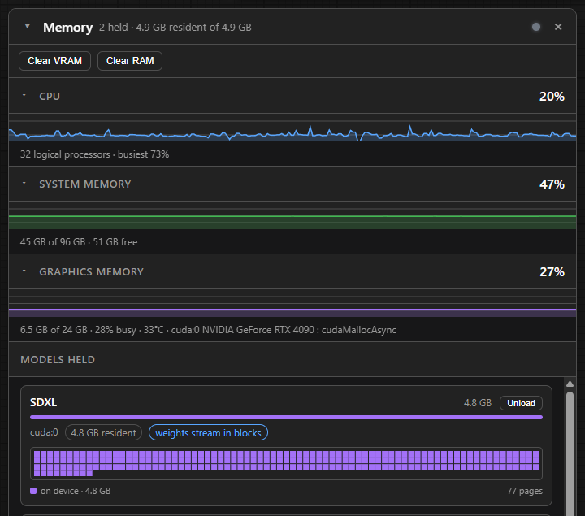

# Resource Monitor

A compact CPU, RAM and VRAM readout, and a Memory panel behind it. No nodes are added to
reach any of this.

A **Memory** button sits beside Downloads and Models and opens the panel, whether or not the
strip is on.

The strip itself is off by default. Switch it on under **Open Manager → Monitor**; it appears in
ComfyUI's floating control bar. Clicking it opens the same panel.

## The strip

`CPU 17% · RAM 49% · VRAM 91% · GPU 46°`

By default a share of a total is drawn as a bar left to right, and a temperature as a column
like a thermometer. A machine with four cards gets four of each, labelled `VRAM:0`, `GPU:0`
and so on. A single card is named without an index. A processor temperature is labelled with
the first eight characters of its sensor's name, and an index where two would read the same.

Six styles, under *How the resource monitor strip is drawn*:

| Style | |
|---|---|
| `mixed` | The default: bars for shares, columns for temperatures |
| `horizontal` | Everything as a bar |
| `vertical` | Everything as a column, each name written down the side of its own |
| `…-compact` | The same, with the text on the bar, or, in the vertical one, no figure at all |

A vertical name is rotated and sits beside the track, never over it. `vertical-compact` leaves
the figure to the hover and is the narrowest style. Each reading's hover names it and gives its
figures.

A column in either vertical style runs the full height of the strip.

## The Memory panel

- **Live graphs** for CPU, system memory and graphics memory, on a fixed nought-to-hundred
  scale so they can be compared by eye. Four minutes of history, kept even while the panel is
  closed. Fold any graph away by its header bar.
- **Models held**: what ComfyUI is holding, how much of each is resident on the card, and how
  much is offloaded.
- **Block maps**: for a model whose weights stream, a square per stretch of the model in the
  order it is written, coloured by where that stretch currently is. The figures step in whole
  pages, so they sit slightly off the byte figure above them; the key says which is which.

## Giving memory back

Two buttons in a strip under the panel's header.

| Button | Frees |
|---|---|
| Clear VRAM | Every model ComfyUI is holding |
| Clear RAM | The cached results of the last run, and the models they hold |

Both ask first, every time:

> Clear VRAM?
> This clears VRAM regardless of what is using it.

Where a prompt is running, the confirmation says so.

**Unload** on a single model does the same for that one and its clones, and asks in the same
way, naming the model, what it frees, and the one guard that does exist:

> Unload SDXL?
> This unloads SDXL regardless of what is holding it.

It is refused while a prompt is running.

## The light

A dot in the panel's header, left of the title. Its hover says why; clicking it lists what every colour means.

| | Means |
|---|---|
| Grey | Idle. Says whether anything is still held. |
| Green | Working: the card is drawing power and getting through it. |
| Teal | *Streaming weights*: the model is larger than the card, and weights are fetched as they are needed. |
| Amber, steady | *Potential memory stall* or *Potential GPU hang*: memory nearly full and nothing advancing. It may just be a slow step. |
| Amber, pulsing | *Memory stalled*: nothing has moved for forty-five seconds with memory full. |
| Orange, pulsing | *Possible GPU hang*: busy, memory full, nothing arriving and nothing advancing. |
| Pink, pulsing | *Streaming thrash*: weights are fetched again as fast as they are dropped. |
| Red | The last run went out of memory, within the last two minutes. |
| Hollow | *Not reporting*: no reading has arrived. |

A quiet card is not a stalled one: it may be waiting on the disk, on a node that runs on the
processor, or on a model being moved. Quiet counts as suspicious only with memory nearly
full, and as stalled only after forty-five seconds without movement.

## When it samples

The server samples only while the strip or the Memory panel is showing, and stops shortly after
neither is.

## What can be read, and what cannot

| Reading | Source | Availability |
|---|---|---|
| CPU load, per core | `psutil` | A ComfyUI dependency; absent readings are omitted, not zeroed |
| System memory | ComfyUI's own `model_management` | Always |
| VRAM, per device | ComfyUI's own `model_management` | Always |
| GPU temperature, utilisation and power draw | NVIDIA's NVML, where installed | Omitted entirely when it is not |
| CPU temperature | `psutil.sensors_temperatures` | Linux only. Windows exposes no such reading to Python, so it is absent there |

A figure that cannot be taken is left out rather than shown as zero, which would read as
"idle" rather than "unknown".

## Settings

Under **Open Manager → Monitor**.

| Setting | Default | What it does |
|---|---|---|
| Resource monitor strip | **off** | Off, nothing is sampled unless the Memory panel is showing. |
| Where the resource monitor strip sits | `control` | `control` is ComfyUI's floating control bar, beside the queue controls and any other monitor already there. `topbar` is the workflow tab strip, ahead of the account button. Falls back to the tab strip where a build has no control bar. |
| Seconds between monitor readings | 2 | Clamped to 1 to 10. The Memory panel asks for one a second while it is open. |
| Show CPU in the monitor strip | on | |
| Show RAM in the monitor strip | on | |
| Show VRAM in the monitor strip | on | |
| Show temperatures in the monitor strip | on | The thermometers, where the platform reports any. |
| How the resource monitor strip is drawn | `mixed` | One of the six styles above. |
| Show the Memory button, which opens this panel | on | Separate from the strip. |
| Run progress bar above the header | off | A strip across the top of the window while a prompt runs: the graph's progress, and the running node's own. |

Shared with every window, under **Open Manager → Windows**:

| Setting | Default | What it does |
|---|---|---|
| Memory panel as a window | on | Off, it opens centred and closes on a click away or Escape. |
| Default window size | `large` | `compact`, `standard` or `large`. Scales each window's own default, so their relative sizes are kept. A window you have resized keeps the size you gave it. |
| Header height | 44 | 24 to 80. |
| Title text size | 15 | 10 to 28. The title bar and section headings, independent of the header height. |
| Content text size | 13 | 10 to 22. Body text inside windows. |
| Drop shadow | on | The shadow that lifts a window off the graph behind it. |
| Windows can be dragged | on | Off, a window always opens in the middle and cannot be moved. On a screen too small to move it around, a window is centred either way. |

And under **Open Manager → Interface**:

| Setting | Default | What it does |
|---|---|---|
| Where the Downloads, Models and Memory buttons sit | `topbar` | `topbar` puts Downloads, Models and Memory in the workflow tab strip with their names. `control` puts them in the floating control bar as icons, with the name on the hover. |

## Related

- [MODELS.md](MODELS.md): what is on disk, as against what is loaded.
- [DOWNLOADS.md](DOWNLOADS.md): fetching models, and where they land.
- [DESKTOP.md](DESKTOP.md): files, notes, outputs and programs, on a tab of their own.
